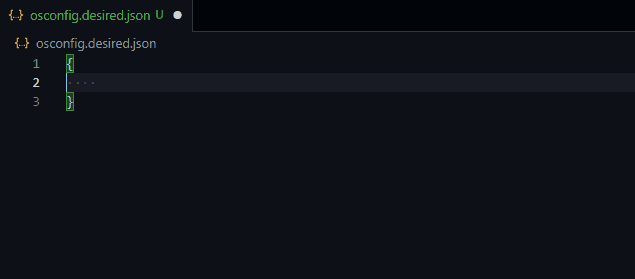

# Azure Edge Security

This extension provides a rich authoring experience for [Azure Device OS Configuration](https://github.com/Azure/azure-osconfig) Desired Configuration (DC) documents.

## Features

- Completion lists and snippets (components, objects, properties, values, etc.)
- Hover information (component, object, enum values, etc.)
- Desired Configuration (DC) document validation
- Customizable model repository *(see [Module Interface Model (MIM)](https://github.com/Azure/azure-osconfig/blob/main/docs/modules.md#3-module-interface-model-mim))*

## Extension Settings

This extension contributes the following settings:

- `osconfig.model.remote`
  - `repository`: The name of the GitHub model repository `<owner>/<repo>`. The name is not case sensative.
  - `path`: The path to the directory containing the MIM JSON files.
  - `ref`: The name of the commit/branch/tag. Default: the repository's default branch (usually `main`)
- `osconfig.model.local.path`: The path to a directory containing a set of MIM JSON files.
- `osconfig.model.priority`: The model repository source to load MIM JSON files from. If the selected source is not available, the next source is used as a fallback.

> By default, the extension will load MIM JSON files from the `main` branch of the [Azure/azure-osconfig](https://github.com/Azure/azure-osconfig) repository (located under `/src/modules/mim`).

---

## Contributing

Have questions or feedback? There are many ways in which you can participate in this project, for example:

- [Submit bugs and/or feature requests](https://github.com/Azure/vscode-edge-security/issues)
- Review [source code changes](https://github.com/Azure/vscode-edge-security/pulls)
- [Contribute directly](CONTRIBUTING.md) to the source code

If you are interested in fixing issues and/or contributing, please see our [Contribution Guidelines](CONTRIBUTING.md).

> Check out the [Azure/azure-osconfig](https://github.com/Azure/azure-osconfig) project for more information and other ways to contribute.

## Code of Conduct

This project has adopted the [Microsoft Open Source Code of Conduct](https://opensource.microsoft.com/codeofconduct/). For more information see the [Code of Conduct FAQ](https://opensource.microsoft.com/codeofconduct/faq/) or contact [opencode@microsoft.com](mailto:opencode@microsoft.com) with any additional questions or comments.

## License

Copyright (c) Microsoft Corporation. All rights reserved.

Licensed under the [MIT](https://github.com/Azure/vscode-edge-security/blob/main/LICENSE.txt) license.
